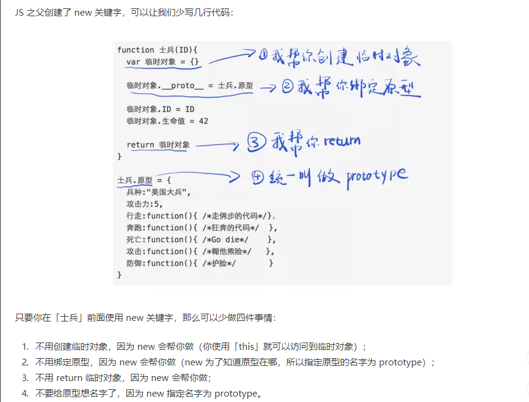
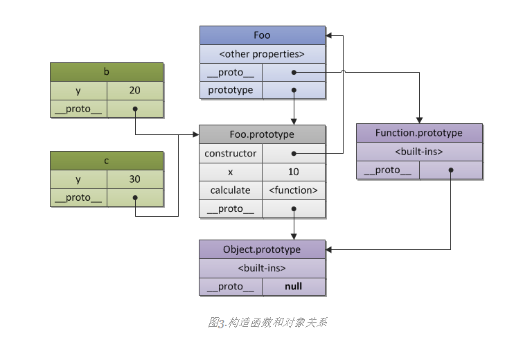

# proto && prototype && constructor && new
> 正确继承情况下，子类设置方法或者属性(指的是赋值或者替换，引用类型内部数据修改还是会的)不会添加到父类。`__proto__`和`prototye`区别在于前者才有我们所说的指向功能。

- [proto && prototype && constructor && new](#proto--prototype--constructor--new)
  - [FAQ](#faq)
  - [`proto && prototype` 进一步](#proto--prototype-进一步)
    - [`__proto__`指向](#__proto__指向)
    - [`construtor `指向](#construtor-指向)
  - [类 - new关键字](#类---new关键字)
  - [继承 - Object.create干了什么](#继承---objectcreate干了什么)
    - [继承 - prototype操作指南](#继承---prototype操作指南)
  - [分析为什么能够继承？](#分析为什么能够继承)
    - [番外 - 私有属性](#番外---私有属性)
    - [总结](#总结)
  - [链接](#链接)
- [内建数据类型](#内建数据类型)
  - [内建数据类型 - prototype](#内建数据类型---prototype)


## FAQ

1. 这三个数值怎么查看？

    以`var a = {}`以及`function Foo() {}`两种方式举例。

    `var a = {}`而`a`结构为(要记住)  
      
      ```
      data
      __proto__
        constructor
          prototype
            constructor
            __proto__
          __proto__
      ```
      
    `function Foo () {}`可以通过`Foo.__proto__ or prototype or constructor`推断

      ```
      data
      __proto__
        constructor
          prototype
          __proto__
      prototype
        constructor
        __proto__
      ```

    可以发现三者之间的结构关系。而且这里的`data`指的是`this`上面的数据。
       
    `var foo = new Foo()`, 详细见 [类 - new关键字](#类---new关键字)

2. `prototype`存在哪里？
    
    `prototype`存在在`construtor`内，而`construtor`存在在`__proto__`内。**可以先看[类 - new关键字](#类---new关键字)做了什么** 可以发现在`new`关键字内部创建了一个临时对象`var a = {}`并返回了`a`。参考上诉`a`的结构。

    可总结`__proto__`包含`construtor`, `construtor包含``prototype`。而这仅仅是一层次关系，因为`prototype` **包含 `__proto__` && `construtor`**

    上一条意味着如果进行`xx.construtor`。是要在`__proto__`上面查找，因为`xx`本身是没有这个属性的。但是`xx.prototype.constructor`就明确了查找位置。

3. 什么是原型？

    * JS中有[几大数据类型](/docs/Grammar/JS-基本类型-值类型.md)，这些就是原型(至于这些数据类型又指向`Object`)就是另外一回事。
    * 原型 = `Number or String etc...`或者另外语义中的抽象类, 可以被`new`的对象。

4. 引用类型。特别涉及到`__proto__ && prototype && construtor`的时候，可以理解为指针。那么其中任意一个赋值都不是简单的赋值，而是引用类型。

## `proto && prototype` 进一步

### `__proto__`指向
> `__proto__`永远指向的是`object.prototype`至于这个`object`, 这个`object`可以理解为抽象类或者未实例的对象

```JavaScript
function Foo() {}
Foo.__proto__ === Function.prototype // true
```

实例对象可分为2种情况举例：

**第1种情况：类以及`new`**

```JavaScript
function Foo() {}
var foo = new Foo()
```
结合[类 - new关键字](#类---new关键字)中结构分析，可以得到`foo`结构如下：

```JavaScript
// 来自Foo函数内部属性
__proto__
  // 来自Foo的prototype
  constructor
  __proto__
```

则`foo.__proto__ === Foo.prototype // true`

**第2种情况：继承**

```javascript
function Foo(name) {
	this.name = name;
}

Foo.prototype.myName = function() {
	return this.name;
};

function Bar(name,label) {
	Foo.call( this, name );
	this.label = label;
}
Bar.prototype = Object.create(Foo.prototype) // or Bar.prototype = new Foo()
Bar.prototype.speak = function () {}
var bar = new Bar()
```

`Foo`的结构

```
data
__proto__
  prototype
    myName
    construtor
    __proto__
```

结合[继承 - Object.create干了什么](#继承---objectcreate干了什么)。我们可以得到`Object.create(Foo.prototype)`执行结果为(也是`Bar.prototype`的结构):


```
__proto__
  // 来自F.prototype，然后F.prototype又等于Foo.prototype。
  // 所以以下来自Foo.prototype
  myName
  construtor
  __proto__
```

添加了`speak`(不会再父类上添加)，之后变为:

```
speak
__proto__
  // 来自F.prototype，然后F.prototype又等于Foo.prototype。
  // 所以以下来自Foo.prototype
  myName
  construtor
  __proto__
```

经过了`new Bar()`返回结果为：

```
name
label
__proto__
  // 来自Bar.prototype
  speak
  __proto__
    // 来自F.prototype，然后F.prototype又等于Foo.prototype。
    // 所以以下来自Foo.prototype
    myName
    construtor
    __proto__
```

所以`bar.__proto__ = Bar.prototype and bar.__proto__ != Foo.prototype`

因此指向原型(见上一条,第三第五点)，更准确的说是`原型.prototype`。(原型指的是未实例化的对象)

### `construtor `指向

由[FAQ](#faq)，可以发现`var a = {} and function foo () {}`有点不同。但是共同特点是，**construtor并不存在于a or foo直接属性上。** a中存在于`__proto__.construtor`，在`foo`中可以存在于`__proto__.construtor and prototype.construtor`

**第1种情况**

```JavaScript
var a = {}
function Foo () {}
a.construtor // = object
// 依据在__proto__上寻找规则。应当为foo.__proto__.construtor。此时为 Function
Foo.construtor 
Foo.prototype.construtor // = Foo
```

**第2种情况 - new**

```JavaScript
function Foo() {}
var foo = new Foo()
```

其中`foo`结构为：

```
data
__proto__
  // 来自Foo.prototype
  constructor
  __proto__
```

所以`foo.constructor = foo.__proto__.constructor = Foo.prototype.construtor // Foo`

**第2种情况 - Object.create**

```javascript
function Foo(name) {
	this.name = name;
}

Foo.prototype.myName = function() {
	return this.name;
};

function Bar(name,label) {
	Foo.call( this, name );
	this.label = label;
}
Bar.prototype = Object.create(Foo.prototype) // or Bar.prototype = new Foo()
Bar.prototype.speak = function () {}
var bar = new Bar()
```

此时`bar`结构为

```JavaScript
name
label // 来自 Bar
__proto__
  //来自Bar.prototype
  speak
  __proto__
    //来自F.prototype = Foo.prototype
    myName
    constructor
    __proto__
```

因此`bar.constructor = bar.__proto__.__proto__.constructor = Foo.prototype.constructor`

## 类 - new关键字

> 首先要知道对象中`(proto&prototype&constructor)`位置信息。`__proto__>constructor>prototype>(__proto__+constructor)`

[new关键字](https://developer.mozilla.org/zh-CN/docs/Web/JavaScript/Reference/Operators/new)到底做了什么?

> 而在 《Javascript设计模式和开发实践》 中提到JavaScript 的函数既可以作为普通函数被调用,也可以作为构造器被调用。**当使用new运算符来调用函数时,此时的函数就是一个构造器。**

更为具体例子可以看[这里](https://juejin.im/post/584e1ac50ce463005c618ca2)，我截了个图关键部分：



因此，设临时对象为`A`，以及士兵为`B`。

`A`结构原本是:

```
data
__proto__
  constructor
    prototype
      construtor
      __proto__
```

`B.prototype`结构原本是:

```
prototype
  一些定义在上面的方法
  construtor
  __proto__
```

经过了`new`操作。现在

`A`结构是:

```
data
__proto__
  一些定义在上面的方法
  construtor
  __proto__
```
    
这就是为什么`var A = new B(20);`之后，控制台中只有`A.__proto__`。`new`关键字将一个`__proto__`替换为了原型的`prototype`内部的存储的内容。

现在在`A`上找方法就会去`__proto__`上面寻找，也就是`B.prototype`

## 继承 - Object.create干了什么

`Object.create`内部具体结构如下:

```Javascript
// Object create。传递参数是一个原型或者原型.prototype
// 所以之前总结prototype的结论应该没有问题
function create (obj) {
  var F = function () {}
  F.prototype = obj
  return new F()
}
```

继承形式一般`Bar.prototype = Object.create(Foo.prototype)`

结合[类 - new关键字](#类---new关键字)可以得到`new F()`得到对象结构为：

```
__proto__
  // 以下来自F.prototype，然后F.prototype又等于Foo.prototype。
  // 所以以下来自Foo.prototype
  construtor
  __proto__
```

### 继承 - prototype操作指南

但是在[JS-继承](/docs/Grammar/JS-%E7%BB%A7%E6%89%BF.md)中明明可以通过`foo.prototype.xx`来操作`prototype`。**所以上诉第二点是在通过`new`关键词创建的实例的情况下**，即如果

```javascript
var newfoo = new foo() // 只能够通过上述第二点查看到prototype

// 但是我们能够通过下述方式操作
foo.prototype.xx = function () {} 
```

来看看下一段代码，仔细研究以下区别！

```javascript
// a constructor function
function Foo(y) {
  // which may create objects
  // by specified pattern: they have after
  // creation own "y" property
  this.y = y;
}
 
// also "Foo.prototype" stores reference
// to the prototype of newly created objects,
// so we may use it to define shared/inherited
// properties or methods, so the same as in
// previous example we have:
 
// inherited property "x"
Foo.prototype.x = 10;
 
// and inherited method "calculate"
Foo.prototype.calculate = function (z) {
  return this.x + this.y + z;
};
 
// now create our "b" and "c"
// objects using "pattern" Foo
var b = new Foo(20);
var c = new Foo(30);
 
// call the inherited method
b.calculate(30); // 60
c.calculate(40); // 80
 
// let's show that we reference
// properties we expect
 
console.log(
 
  b.__proto__ === Foo.prototype, // true
  c.__proto__ === Foo.prototype, // true
 
  // also "Foo.prototype" automatically creates
  // a special property "constructor", which is a
  // reference to the constructor function itself;
  // instances "b" and "c" may found it via
  // delegation and use to check their constructor
 
  b.constructor === Foo, // true
  c.constructor === Foo, // true
  Foo.prototype.constructor === Foo, // true
 
  b.calculate === b.__proto__.calculate, // true
  b.__proto__.calculate === Foo.prototype.calculate // true
 
);
```

上面代码我们得到下图：




* 两段代码可以得到 **`prototype` 只有原型(普通函数可以作为原型，但是异步函数不行，箭头函数也不行)有。而 `newfoo` 想要操作 `prototype` 可以根据以上结论通过`newfoo.__proto__`来找到**(一般也不会这么做)
* 后面一段代码的指示是，如果想要找到`b`上面的方法，会从`b.__proto__`上面找，**也就相当于从它的原型(`Foo.prototype`)上面找**。


## 分析为什么能够继承？

在[JS继承](/docs/Grammar/JS-%E7%BB%A7%E6%89%BF.md)中，我总结了可以通过以下方式继承！

```javascript
function Foo(name) {
	this.name = name;
}

Foo.prototype.myName = function() {
	return this.name;
};

function Bar(name,label) {
	Foo.call( this, name );
	this.label = label;
}
Bar.prototype = Object.create(Foo.prototype) // or Bar.prototype = new Foo()
Bar.prototype.speak = function () {}
var bar = new Bar()
```

此时`bar`结构为

```JavaScript
name
label // 来自 Bar
name // 来自name
__proto__
  //来自Bar.prototype
  speak
  //name // 如果使用Bar.prototype = new Foo()。来自FOO
  __proto__
    //来自F.prototype = Foo.prototype
    myName
    constructor
    __proto__
```

**题外话：** 可以发现 **子类**定义在`prototype`上定义方法是写在父类`__proto__`之外的。所以子类定义定义方法一般并不会影响父类(除非子类直接操作`__proto__`)

1. 因为`new`可以创建实例，所以`Bar.prototype = new Foo()`改变`prototype`这个内容。
2. `Object.create`同样有创建指针的工作。因此可以通过`Bar.prototype=Object.create(Foo.prototype)`

现在我们来分析为什么？

**第一种继承方式**

`Bar.prototype = new Foo()`, `Bar.prototype`在没有经过这操作之前

1. `Bar.__proto__`指向原型，也就是`Function`
2. `Bar.prototype`含有`construtor && __proto__`（就像是第二点提到的）现在经过了`Bar.prototype = new Foo()`相当于我们改变了`Bar.prototype`指向(或者说将里面东西全部替换掉了为 **新创建的Foo，而不是原始的Foo**)。此时`Bar.prototype`可以访问`Foo`中`this`的数据。
3. 以上两步骤就是先了继承，因为此时`Foo`被`Bar`共享了。可以通过`Bar.prototype.xxx`在继承之后，对`prototype`这个对象实现添加新函数或者属性
4. 然后我们`var newbar = new Bar()`。
  1. `newbar`是通过`new`创建的(没有了`prototype`，我们无法直接操作`prototype`)
  2. `newbar.__proto__`指向`Bar.prototype`，而`Bar.prototype`已经被我们改掉了，里面的 **内容变为了**变为指向`Foo.prototype+之后添加的新函数属性`。在后期使用过程中，所以可以使用`Foo`的方法。

这种继承方式最大的问题在[JS-继承最佳实践解析](/docs/Grammar/JS-%E7%BB%A7%E6%89%BF%E4%BB%A5%E5%8F%8A%E7%B1%BB-%E6%9C%80%E4%BD%B3%E5%AE%9E%E8%B7%B5%E8%A7%A3%E6%9E%90.md)中分析了。

**第二种继承方式**`Object.create`内部具体结构如下:

```Javascript
// Object create。传递参数是一个原型或者原型.prototype，所以之前总结prototype的结论应该没有问题..
function create (obj) {
  var F = function () {}
  F.prototype = obj
  return new F()
}
```
如此我们实现了继承。

同时父类和子类别是可能含有不同的函数，`newbar.myName`在本身的`newbar.__proto__ or Bar.prototype上`找不到，就会向父类`Foo.prototype`查找。就是`__proto__`中嵌套的`__proto__`(嵌套就是父级上面找)

同时`new`关键字(具体可见`new`关键字内部实现)也是利用上面`__proto__`指向了原型的`prototype`的特性来返回一个临时的对象。

**以上继承方式`Foo.call()`**是较为关键的一点，在[JS-继承最佳实践解析](/docs/Grammar/JS-%E7%BB%A7%E6%89%BF%E4%BB%A5%E5%8F%8A%E7%B1%BB-%E6%9C%80%E4%BD%B3%E5%AE%9E%E8%B7%B5%E8%A7%A3%E6%9E%90.md)分析了为什么。

**Q&A -**那么为什么不`Bar.prototype = Foo.prototype`

```JavaScript
label
name
__proto__
  speak
  // 来自FOO
  myName
  construtor
  __proto__
```

由于`Bar.prototype = Foo.prototype`那么`Bar.prototype.speak = function () {}`不同于以上有一个`__proto__`阻挡。所以同样也会添加到`Foo`。子类也能够修改父类了。

### 番外 - 私有属性

除了在函数内部以及`prototype`上定义属性之外。还有一种比较奇怪的方式。

```JavaScript
function f () {}
var newf = new f()
```

**第1种情况：**

```JavaScript
function f () {}
f.name = 'f'
f.prototype.showname = function () {
  console.log(f.name)
}
var newf = new f()
```

可以得到`newf`结构为：

```JavaScript
somedata // from f
__proto__
  showname //  from f
  constructor
    name // f.name = 'f'
  __proto__
```

可以是 **写在`constructor`内部，不会暴露出来。因此`newf.name`是无法访问的。** 但是不同于以下方式(可以被`newf`访问)：

```JavaScript
function f () {
  this.name = 'f'
}
```

但是`f.name`却可以通过`showname`方式访问，可以看出来，这像是什么？没错就是私有属性。而且是非闭包的私有属性！

**第2种方式：**

```JavaScript
function f () {}
var newf = new f()
newf.name = 'newf'
```

可以得到`newf`结构为：

```JavaScript
somedata // from f
name // from newf.name
__proto__
  showname //  from f
  constructor
  __proto__
```

举例到继承，如果我们通过：

```JavaScript
function Foo(name) {
	this.name = name;
}

Foo.prototype.myName = function() {
	return this.name;
};

function Bar(name,label) {
	Foo.call( this, name );
	this.label = label;
}
var newf = new Foo()
newf.newname = 'newname'
Bar.prototype = newf
Bar.prototype.speak = function () {}
var bar = new Bar()
```

虽然现在一般不使用这种方式建立继承。

但是明显此时`bar`是可以访问到`newname`的。

### 总结

1. 由于`__proto__`具有向上查找的特性。
2. `new or object.ceate`具有替换`__proto__ value`某个`prototype`所以可以实现继承`prototype`上的属性方法。
3. 在子类中`parent.call(this)`是为了继承父类`constructor`内的属性方法。
4. 写在`prototype`上的方法对于每个实例都是相等的，而`constructor`内的属性方法都是不等因为`Foo.call(this)`。
5. 写在`Foo.xx`的方法是私有的。

见[JS-继承与类-类与类的原型]()

## 链接

* [外文解析-我觉得写的不错](http://dmitrysoshnikov.com/ecmascript/javascript-the-core/)  

# 内建数据类型

> 内建类型和`function`一样都有`prototype`

## 内建数据类型 - prototype

在[FAQ](#faq)中指出`var a = {}`没有`prototype`，而`function f`是有的。

但是像`Array or Object or Number`都是能够操作`prototype`。

```JavaScript
// 但是以下prototype就消失了
var num = 1
var obj = {}
var arr = []
```

可以这么理解，获取是经过了`new Array or new Object or new Number`操作才有了我们看到的`1 [] {}`。

对比上面的`new`关键字操作，所以我们看不到`prototype`只有`__proto__`。

因此对应`num obj arr`指向的是`new Array or new Object or new Number .prototype`