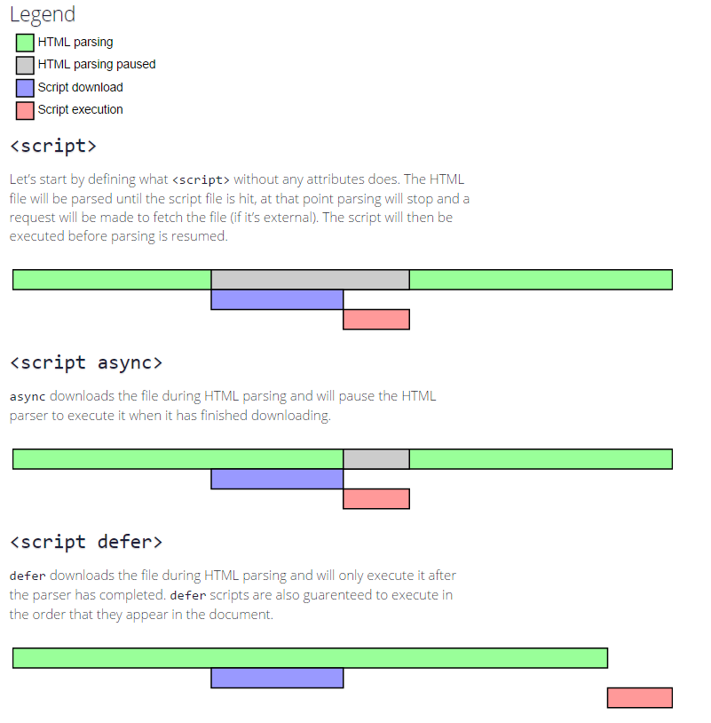

# HTTP - 输入地址到显示页面
> 包含了现代浏览器如何优化(优化JS/CSS加载)

<!-- TOC -->

- [HTTP - 输入地址到显示页面](#http---输入地址到显示页面)
  - [1.1. 概述](#11-概述)
    - [1.1.1. 建立连接概述](#111-建立连接概述)
  - [1.2. 优化](#12-优化)
    - [1.2.1. DNS优化](#121-dns优化)
    - [1.2.2. CSS优化](#122-css优化)
    - [1.2.3. JS优化](#123-js优化)
  - [1.3. 参考链接](#13-参考链接)

<!-- /TOC -->

## 1.1. 概述

当我们请求地址，获得了`html`中 **标签**包括`dom&link`，`link`中`css`文件并没有下载，而 **`dom`元素已经跟随`.html`文件下载回来了。** 等待样式文件下载完毕参与构建。

页面加载是否快速，涉及到以下几个方面。这篇文章总结的也只是 **第五点-CSS&HTML&JS对页面渲染的影响！** 以上从上到下也就是输入`url`到页面出现所发生的一切。

1. DNS 查询 - 查询`www.baidu.com`对应的`ip`地址。因为路由器需要知道向那个ip地址发送。
2. TCP 连接 - 只有tcp建立了链接才能够建立http
3. HTTP 请求即响应
4. 服务器响应 - 对于响应结果进一步处理方式有，保存`cookie`以及缓存资源。如果资源已经缓存了(且没有过期)，那么就本地读取。
5. 客户端渲染

### 1.1.1. 建立连接概述

1. 输入URL地址，尝试发起HTTP请求，此时没有建立TCP连接，无法发送数据
2. 尝试建立TCP连接，发现没有目标IP地址
3. 对url进行DNS解析，得到目标IP地址。

得到IP之后，就是数据发送的过程。那么HTTP数据封装到TCP数据中，TCP数据分装到IP数据中。如下图：


**全部具体过程见参考链接！**

## 1.2. 优化

`HTML`的标签(指的是`div p etc...`)我们无法优化，**当然如果能够使用最少元素构建是最好的，避免较多的标签嵌套**。我们只能够从`DNS&CSS&JS`角度触发。

### 1.2.1. DNS优化

见[文章1](http://bubkoo.com/2015/11/19/prefetching-preloading-prebrowsing/)or[文章2](https://github.com/GeoffZhu/geoffzhu.github.io/issues/2) - 里面对图片等资源的预加载。

### 1.2.2. CSS优化

页面中的`CSS`从开始到渲染涉及到三个过程：

1. 加载
2. 构建`CSS-DOM-TREE`
3. 渲染

其中前两个是可以优化的。

**加载优化**

合并`CSS`文件可以减少`HTTP`请求，可以优化。**但是假设我们有两个个样式文件，其中一个全局(无论什么条件下都会起作用)，其余一个是`media query`作用在屏幕尺寸改变的时候**

明显后面那个是不需要再页面加载的时候就加载进来的。可以比第一个稍微延迟一点。因此我们可以通过

```HTML
<link href="index.css" rel="stylesheet">
<link href="print.css" rel="stylesheet" media="print">
<link href="other.css" rel="stylesheet" media="(min-width: 30em) and (orientation: landscape)">
```

后面两个添加了`meida`，所以会延迟加载，也就是当加载好`index.css`之后，就会开始进行`HTML-DOM-TREE`构建。而后面两个会同步加载，但是不会影响`CSS-DOM-TREE&HTML-DOM-TREE`构建。至少再页面开始的时候是这样的。

**构建优化**

1. 给需要标签添加`class`是优化重要步骤 - 此时要涉及到`CSS-DOM-TREE`的构建规则，如果看过`JQ`实现其选择器的源码的话，就会发现它 **并不是从左到右边的选择**，即当`.class a`，并不是找到`.class`元素，然后再再其中找到`a`元素。

    而是遵循从右到左原则，先找到`a`元素然后再由上找到`.class`元素。浏览器也是这样的规则。

    所以页面众多`a`标签，却只有`.class`元素。先是找到`a`标签，由于`a`标签过多，这一步很影响，所以给需要的`a`标签添加`class`是优化重要步骤。

    
这部分的[参考链接](https://zhuanlan.zhihu.com/p/29418126)

2. `CSS-DOM-TREE`树结构优化 - 首先这是个书结构，所以层级不要太深，树结构不要太复杂能够优化解析。
    * 选择器不要太多，比如说从`html`标签开始选择一个`a`标签
    * 不要使用比较短的`class-name`

[参考-编写高效的CSS](https://www.oschina.net/translate/writing-efficient-css-selectors) - 不过也要从适合自己角度触发。

### 1.2.3. JS优化

一般来说JS在下载和运行过程中都会干扰到HTML解析。所以一般会放在最后。



和`CSS`一样，页面中的`JS`从开始到渲染涉及到三个过程：

1. 加载
2. 运行
3. 渲染

**运行优化 - `defer or async`**

完整部分见[Browser-浏览器渲染过程](https://github.com/JiangWeixian/JS-Tips/blob/master/docs/Broswer/Browser-%E6%B5%8F%E8%A7%88%E5%99%A8%E6%B8%B2%E6%9F%93%E5%8E%9F%E7%90%86.md)

1. 无论是否有`defer or async`属性，将`script`标签写到页面最后是相对稳妥的做法。
    * 没有兼容性问题
    * 优化不阻塞DOM(相对于`normal script`写在头部) 
2. `defer & async`属性优势只会 **将`script`标签写在头部的时候才会看出来**
    * 共同特点 - 加载`JS`的时候 **不干扰HTML解析，但是运行的时候还是会**
    * `defer` - 延迟。**并在`HTML-DOM-TREE`解析完毕(一个叫`DOMContentLoaded`事件)之前，且`JS`加载完毕之后执行。** 而且，所以两个defer脚本的执行顺序是可以保证的。按书写顺序。
    * `async` - 同步。但是是在 **JS加载完毕之后** 执行(执行的时候还是干扰了dom)。并不会等待`HTML-DOM-TREE`解析完毕。**不依赖其他脚本**。两个`async`脚本的执行顺序无法保证。
3. 也就是说`async`可能在`defer`之前或者之后都有可能。

**注意0: - 一般将defer脚本放在最后是为了兼容ie**

**注意1 - 现代浏览器已经支持的是并行下载script资源(在没有设置以上情况下)，但是会干扰其他资源下载**。也就是说上面两个其实设置的执行顺序。

**注意2 - chrome调试工具可以看到initator判断是谁发起了js请求。来自script标签说明是动态添加了脚本**。如果是来自`parser`就是直接写在html里面的。可以[async&defer](https://github.com/JiangWeixian/JS-Tips/tree/master/Demos/async%26defer)的例子。在这个例子中，可以得到：

0. 动态添加的脚本，默认开`async`
1. 如果html文件很小，defer async脚本开始加载的事件相同。但是`async`执行要滞后在`defer`之后。至少在`chrome`里面是这样的。
2. 而动态添加的脚本 **开始加载的时间**一般是在`defer async or other`此类写死在`html`脚本之后的。

这就是为什么[知乎-某答案network中js加载时间async延后defer那么多](https://www.zhihu.com/question/20531965)

**JS与DOM**

更多细节可看[HTML-DOM优化指南](https://github.com/JiangWeixian/JS-Tips/blob/master/docs/HTML/HTML-DOM%E4%BC%98%E5%8C%96%E6%8C%87%E5%8D%97.md)

指的是对`DOM`修改这一部分

不要逐条修改`css`样式，将改变的样式写到一起，一起修改；也可以改变`classname`实现样式的变化。

## 1.3. 参考链接

* [HTTP-OSI建立链接全过程](https://juejin.im/entry/58ce00c5ac502e00589b4bde)
* [HTTP-建立链接过程更为详细](https://juejin.im/post/5872309261ff4b005c4580d4)