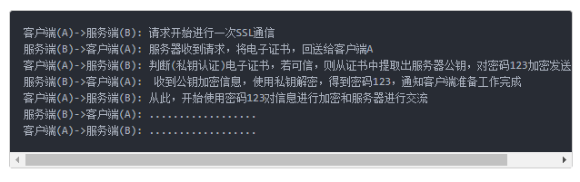

# 是HTTPS而不是HTTP
> https正在被大规模使用

## 前置知识

**关键技术：**

1. SSL
2. 数字证书(CA) - 第三方验证，一般和硬件绑定。

**对使用者心动的好处**

不会被运营商劫持，并加入广告。

## 流程

## 解释

见[深入浅出nodejs-网络编程](https://github.com/JiangWeixian/JS-Books/tree/master/%E6%B7%B1%E5%85%A5%E6%B5%85%E5%87%BA%E5%AD%A6%E4%B9%A0Nodejs/CH7-%E7%BD%91%E7%BB%9C%E7%BC%96%E7%A8%8B)

## 链接

* [维基百科解释](https://zh.wikipedia.org/wiki/%E8%B6%85%E6%96%87%E6%9C%AC%E4%BC%A0%E8%BE%93%E5%AE%89%E5%85%A8%E5%8D%8F%E8%AE%AE)
* [对加密方式和数字证书等解释比较清除](https://www.jianshu.com/p/0e153f62fe32)
* [https优势](http://www.techug.com/post/https-ssl-tls.html)