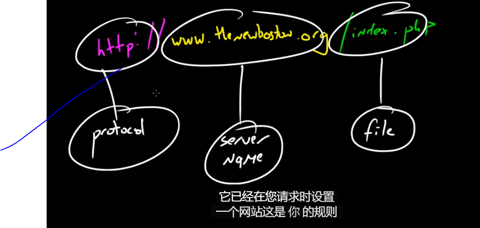
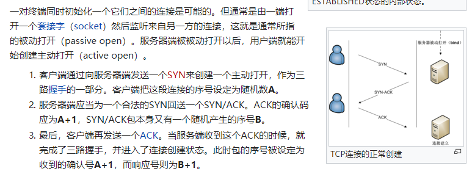
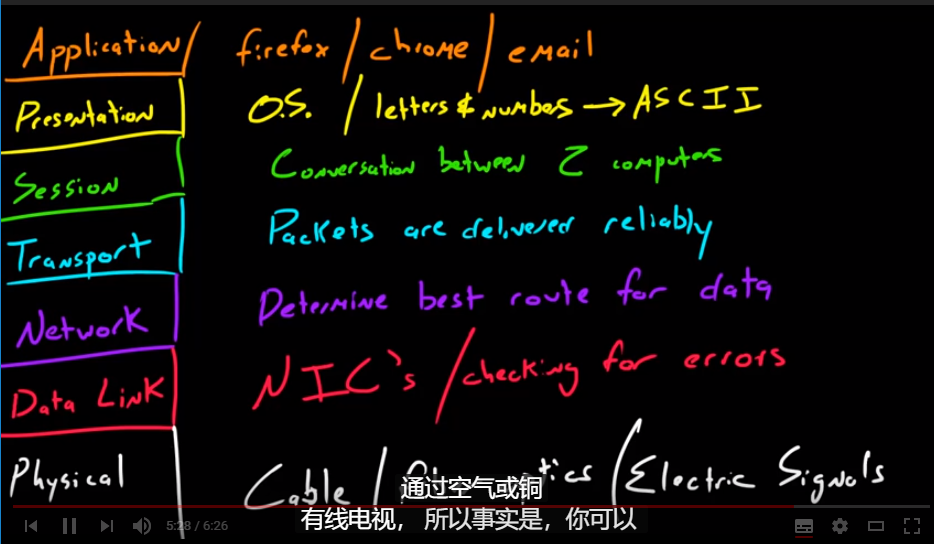
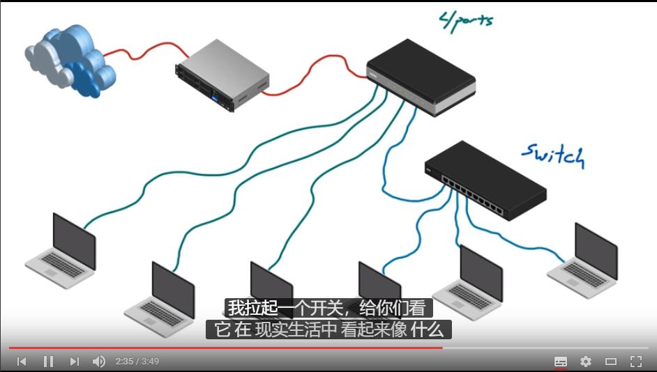
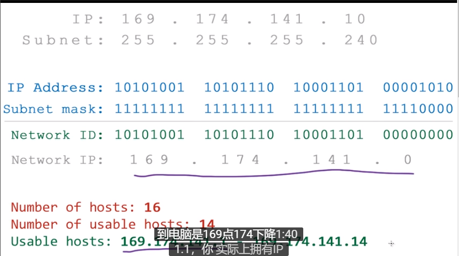
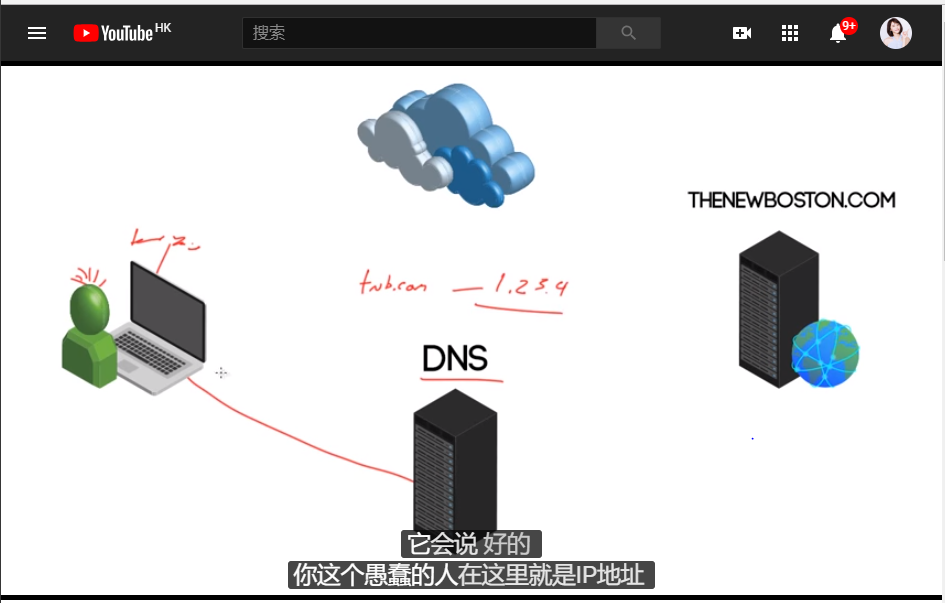

# 计算机网路基础
> 

* [文档连接](https://blog.csdn.net/basycia/article/details/51880172)
* [youtube视频地址](https://www.youtube.com/watch?v=EcbyD_YycPA&index=2&list=PL6gx4Cwl9DGBpuvPW0aHa7mKdn_k9SPKO)

<!-- TOC -->

- [计算机网路基础](#计算机网路基础)
  - [正文](#正文)
    - [Basic](#basic)
    - [Protocols](#protocols)
    - [拓扑协议](#拓扑协议)
    - [[OSI](https://zh.wikipedia.org/wiki/OSI模型)](#osihttpszhwikipediaorgwikiosi)
    - [网络流程](#网络流程)
    - [IP](#ip)
    - [DHCP](#dhcp)
    - [NAT](#nat)
    - [更多](#更多)

<!-- /TOC -->

## 正文

视频教程速写。

### Basic

计算机网络，不同设备之间连接。传递数据。

有许多网络类型。

* lan - local，计算机被限定在一个范围内。
* man - 城市，可以理解多个local
* wan - wire，多个man。大小有限制。

服务器可以理解是特殊的电脑，只不过很多可以访问它。

### Protocols

数据传输协议。三次握手之类的，`http`。

* [cookie](https://zh.wikipedia.org/wiki/Cookie)
    *  保存在客户端，每次http都会发送。
* [http](https://zh.wikipedia.org/wiki/%E8%B6%85%E6%96%87%E6%9C%AC%E4%BC%A0%E8%BE%93%E5%8D%8F%E8%AE%AE) 
    * tcp    
* [三次握手](https://zh.wikipedia.org/wiki/%E4%BC%A0%E8%BE%93%E6%8E%A7%E5%88%B6%E5%8D%8F%E8%AE%AE) - tcp建立连接的方式

1. 客户端通过向服务器端发送一个SYN来创建一个主动打开，作为三路握手的一部分。客户端把这段连接的序号设定为随机数A。
2. 服务器端应当为一个合法的SYN回送一个SYN/ACK。ACK的确认码应为A+1，SYN/ACK包本身又有一个随机产生的序号B。
3. 最后，客户端再发送一个ACK。当服务端收到这个ACK的时候，就完成了三路握手，并进入了连接创建状态。此时包的序号被设定为收到的确认号A+1，而响应号则为B+1。

如果服务器端接到了客户端发的SYN后回了SYN-ACK后客户端掉线了，服务器端没有收到客户端回来的ACK，那么，这个连接处于一个中间状态，即没成功，也没失败。于是，服务器端如果在一定时间内没有收到的TCP会重发SYN-ACK。在Linux下，默认重试次数为5次，重试的间隔时间从1s开始每次都翻倍，5次的重试时间间隔为1s, 2s, 4s, 8s, 16s，总共31s，第5次发出后还要等32s才知道第5次也超时了，所以，总共需要 1s + 2s + 4s+ 8s+ 16s + 32s = 63s，TCP才会断开这个连接。使用三个TCP参数来调整行为：tcp_synack_retries 减少重试次数；tcp_max_syn_backlog，增大SYN连接数；tcp_abort_on_overflow决定超出能力时的行为。

### 拓扑协议

物理连接方式，也有虚拟的。以[总线拓扑协议](https://zh.wikipedia.org/wiki/%E5%8C%AF%E6%B5%81%E6%8E%92%E6%8B%93%E6%92%B2)为例。有点类似电路里面的串联结果，就连数据流动也可以类比电流。只不过数据是有协议的。

最常见应该是星状的，**最重要的区别就是有路由器了，这就导致了拓展十分方便。因为路由和服务器连接，客户端和路由器连接。至少其中线路或者客户端坏了，不会整个网络崩溃。**

### [OSI](https://zh.wikipedia.org/wiki/OSI%E6%A8%A1%E5%9E%8B)

七层结构那个。如图，从上到下的运行流程。

### 网络流程

路由连接网络之前需要连接`modern`。其作用就是调制解调信号。

**路由和交换机区别**：交换机没有无线功能；交换机和路由连接，扩张路由的接口，可以连接更多设别。

repeater用来增强信号，解决无线信号逐步减弱的问题。

### IP

需要解决寻址问题。

ip由32bit组成。前面16表示网络地址。后面16表示主机。

由于长度固定，所以一个ip地址代表的网络数目和主机数目都是一定的。那么如果一个网络内的主机数目是少于规定的话，掩码就是为了解决这个问题的。

要组合掩码来理解。如上图：

* 通过`ip address`和掩码我们得到一个网络`id`。告诉信息数据应该发送到哪里？
* 剩下的没有使用到的`bit`。就是该网络地址下的主机数目。如上图就是只有4个`bit`位置来制定主机数目，一共16个。又其中2个主机地址不能使用，因为一个代表主机地址，另一个代表广播地址。

**DHCP**动态分配ip地址。

**DNS**域名到ip地址转换。如下图：

修改hosts文件可以类比dns，因为hosts文件就是域名和ip地址对。如果我们添加`127.0.0.1 xxx.com`你访问`xxx.com`就回去去`127.0.0.1`。

### DHCP

[**DHCP**](https://www.youtube.com/watch?v=S43CFcpOZSI)动态分配ip地址。

简单的从局域网来说，计算机请求`ip`地址(192.168.0.1)，然后`dhcp`服务器分配这个地址如果这个地址可以使用的话。更广的网络应该也是类似的过程。

### NAT

[NAT](https://zh.wikipedia.org/wiki/%E7%BD%91%E7%BB%9C%E5%9C%B0%E5%9D%80%E8%BD%AC%E6%8D%A2)因为计算机数目多，但是ip地址就那么几位，一定不够用。

路由器分配得到内网ip(局域网ip地址)，内网ip和外网ip之间映射。比较常用的是外网ip+端口号的方式。

### 更多

`iptables`可以过滤来自某个IP地址的信息。