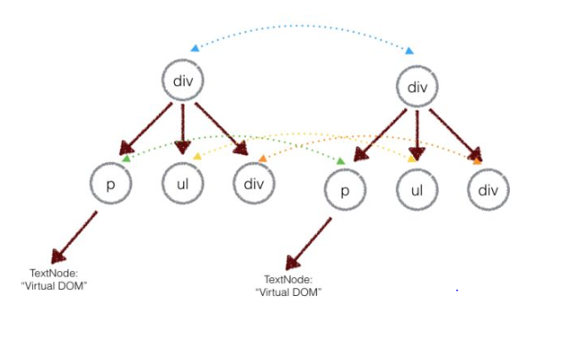

# 前端框架之间对比
[[toc]]

## 前置知识

框架的进化流程大致：

1. 数据完全由后台给定，前端只有根据后台数据来更新渲染，控制权少
2. 引入数据模型，当前端的数据模型改变的时候触发一些事件，前端有义务来控制当这些事件发生之后该做些什么
3. 

### 什么是virtual dom

* [参考文章-译文-十分细致的介绍](https://www.jianshu.com/p/bef1c1ee5a0e)
* [参考文章-原文](http://teropa.info/blog/2015/03/02/change-and-its-detection-in-javascript-frameworks.html)

就现在而言，数据和页面绑定十分紧密，数据更新带动页面更新。而在没有这些框架之前，每次数据更新都要向后台请求数据。**而现在我们有了新的方式：数据和DOM节点绑定，数据更新然后节点更新。**，类如`angularJS`。

虚拟DOM是`React`引入的，`virtual dom`和`real dom`区别就在于，数据更新之后并不直接渲染`real dom`，而是`virtual dom`。至于是否要渲染到`real dom`，就要对比数据更新之后的`virtual dom`和之前`virtual dom`之间的区别。

`virtual dom`本质上又是什么？是怎样的数据类型。就我的理解来看：

`virtual dom`可以是`js`对象，就`es6`阶段的话。可以是一个`class`。那么渲染数据更新流程就可以是以下方式;

1. 先有数据
2. 然后根据数据生成`virtual dom{0}`
3. 数据改变，改变`virtual dom{1}`。和`virtual dom{0}`比较，如果变化了，就更新`dom`。至于怎么检查是否发生了数据更新。就是另外一回事了。

### 如何实现virtual dom简易版本

* [来看看别人是怎么实现的？ - 解析](https://www.zhihu.com/question/29504639)
* [github实现版本](https://github.com/Matt-Esch/virtual-dom)

以上了解了思路，最最关键就是实现数据和视图之间的绑定。一旦数据变化，就触发更新`DOM`的函数。

1. 构造`virtual dom`结构（`JS`数据类型），不限制写法，只要能够通过`virtual dom`恢复出真正的`dom`结构就可以了。
2. 构造`render`函数（就像是`vue react`那样），根据`virtual dom`实现真正节点生成。
3. 数据更新不是实现重点，因为这是用户行为。**重点在于如何检测数据更新**
    
假设我们有以下树结构：



* 对树进行[深度遍历](https://zh.wikipedia.org/zh-hans/%E6%B7%B1%E5%BA%A6%E4%BC%98%E5%85%88%E6%90%9C%E7%B4%A2)，得到数组结构，得到每个节点标识，有利于比较虚拟`DOM`差异，以及后续更新。（**看了维基百科还是有问题，请看[这里](https://juejin.im/entry/5912bb9544d904007b0384f1)**）  
* 节点差异记录在数组内，并记录差异类型。不同差异决定如何对真实`dom`如何操作。甚至节点只是移动了也会有差异类型，让框架知道只需要移动节点而不需要重新创建和差异节点。

4. 将差异映射到真实`dom`上，依赖于之前创建的`virtual dom`结构。   


## 前端框架类型

[阮一峰科普](http://www.ruanyifeng.com/blog/2015/02/mvcmvp_mvvm.html)

* MVC - 数据，视图，控制器
    * 用户在视图上传递指令给控制器，控制器改变数据，数据在映射到视图上。**不过不一定是这样的流程，用户有直接控制控制器，视图，或者数据的能力**
* MVP - 特别少见，介绍也很少。特点在于
    * 三个模块之间一定是双向的（MVC一般是单的，但是没有规定）
    * v和m之间都要通过p来进行传递数据
* MVVM - VM含义为`viewmodel`，主流框架基本都是这个类型。类如`MVP`，不过v和vm之间是自动双向通信过程。

区分这三者有点难度，因为是很细节的差别。可以看[这里](http://www.cnblogs.com/xishuai/p/mvc-mvp-mvvm-angularjs-knockoutjs-backbonejs-reactjs-emberjs-avalonjs.html)，简单总结为：

1. 视图渲染，`MVC`有`View`控制渲染(`compiler`)，`Controller`负责的只是通知作用。而在`MVP`是`P`，而在`MVVM`内部则是`Viewmodel`。
2. `MVVM`是`MVP`的进化版本，最重要就是双向绑定（自动挡），任何一个方面发生变化，都会进一步影响到其他两个方面。

将`HTML`节点是为**View**，将数据视为`Model`。`ViewModel`就是两者之间的桥梁。

* 在`Vue`就是类比`ViewModel`的就是数据劫持（包含观察者，订阅者，compile）。`React`应该也是。

### Vue

类似`React`，因为使用到了`virtual dom`。不过最新的`Angular`好像也加入了。

* 语法上更接近`html js css`结构，不像是`react`全是`js`
* 数据监听上是**数据劫持**
* 重点在于双向绑定的方式

[生命周期图示可以帮组理解](https://cn.vuejs.org/v2/guide/instance.html#%E7%94%9F%E5%91%BD%E5%91%A8%E6%9C%9F%E5%9B%BE%E7%A4%BA)

**如何实现双向绑定的方式？**，实现方式有发布订阅模式，`Angular`的脏检查模式，或者是`Vue`的数据劫持模式。可以参考[这里](https://segmentfault.com/a/1190000006599500)。`Vue`数据集劫持模式结合了发布订阅，其关键点在于：

1. 实现`Observer`(观察者) - 也就是对某些属性，定义`setter&getter`。关键就在于这个`setter`，监听数据变化。也相当于一个观察者。
2. 定义一个**订阅者**（`Watcher`，可以是一个数组，来维护谁需要这些数据），也就是谁需要这些数据。
3. `setter`改变数据之后，通知订阅者，每一个订阅者本身可能有一个`update`函数，当被通知的时候，就更新视图之类的。


### Angular

MVVM

建立数据和视图之间联系，每次数据更新，就更新部分`DOM`（也就是数据和`DOM`绑定）。

不过在数据更新之上，还有一个**观察者**，来检测是否数据更新，是否进行UI更新。

其特点为：

* 任意发生事件，都会触发观察者
* 只会更新部分`DOM`，不会重新渲染全部页面
* 数据监听上是**脏检查**

### React

虚拟`DOM`的应用！

* 有一个由`Javascript`构成的虚拟`DOM`结构。
* 每次数据变化，渲染的所有`UI`。不过这里的`UI`需要打上引号，因为指的是虚拟`DOM`的`UI`。进一步的`React`比较得到的新旧虚拟`DOM`，来决定是否渲染。此时的渲染就是可以跟踪到某个具体的被改变的节点元素。流程如下：
    1. 数据变化
    2. 得到新的虚拟`DOM`，和旧的比较
    3. 得到被改变的那些节点
    4. 更新具体的`DOM`阶段

## 更为细节的对比

### 回调函数

对`React`来说，给组件添加回调函数和平时`dom`没事区别，如`a.onclikc = ...`。包括那些`event`的获取，传递函数等。

但是对`Vue`来说有点不太一样了。如

```js
<a
  onClick="handleclick(e)"
>
</a>
```

> 好像是`handleclick`与`handleclick(e)`并没有什么区别。注意这个`e`是来自`data`等数据来源（或者列表）。如果想要`event`，必须通过`$event`进行传递。**必然！`Vue`对语法解析依赖更为严重。**
