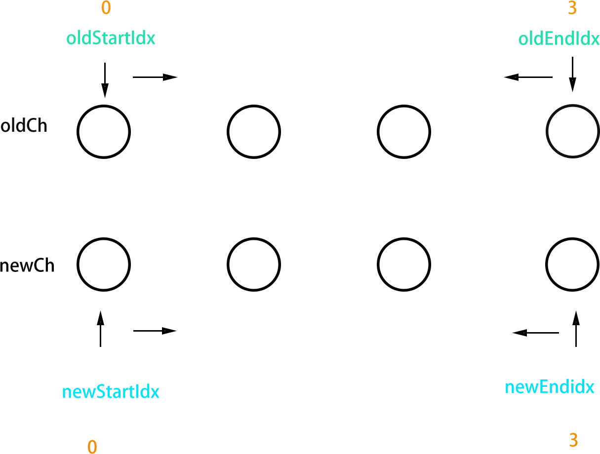

# Vue - 实现原理
> 理解几个关键点！能力就那样，说的不好...

<!-- TOC -->

- [Vue - 实现原理](#vue---实现原理)
  - [1.1. Kepoints](#11-kepoints)
  - [1.2. 前置知识](#12-前置知识)
    - [1.2.1. 数据劫持/发布更新](#121-数据劫持发布更新)
    - [1.2.2. 编译](#122-编译)
    - [1.2.3. 虚拟DOM](#123-虚拟dom)
  - [1.3. 实现 - 数据劫持](#13-实现---数据劫持)
    - [1.3.1. 需要一个订阅者](#131-需要一个订阅者)
    - [1.3.2. 整体逻辑](#132-整体逻辑)
  - [1.4. 实现 - 编译](#14-实现---编译)
    - [1.4.1. 更新指令](#141-更新指令)
  - [1.5. 虚拟DOM](#15-虚拟dom)
    - [1.5.1. 虚拟DOM的 - diff算法](#151-虚拟dom的---diff算法)
  - [1.6. 链接](#16-链接)

<!-- /TOC -->

## 1.1. Kepoints

1. 数据动态响应 - 数据劫持/发布更新
2. 将`.vue`文件便以为页面文件(展示出来)
3. 虚拟DOM

**先给出Vue周期图：**

以上三个节点发生在`created and mounted`之间。最后变为我们看到的文件`.html js(根本没有vue)`。

而`updated`可能复用的所述`created and mounted`之间，因为`updated`更新节点是一个可复用的操作。再`created and mounted`之间也有涉及。

## 1.2. 前置知识 

### 1.2.1. 数据劫持/发布更新

`vue`做的是将获取数据和更改数据的接口劫持了：

* `setter` - 就将调用 **订阅者队列每个订阅者的更新函数**。
* `getter` - 先订阅者队列添加订阅者

### 1.2.2. 编译

初始工程是`.vue`混合了多个文件。

第一个不需要将每部分提取出来，比如说将`html`部分拼接。合并为整个`html`文件。

### 1.2.3. 虚拟DOM

在[DOM优化指南](https://github.com/JiangWeixian/JS-Tips/blob/master/HTML/HTML-DOM%E4%BC%98%E5%8C%96%E6%8C%87%E5%8D%97.md)提到了，直接操作dom其实效率不高。js数据结构更快一些。

所以将`html`代码变为`virtual dom`。实现`html->virtual dom->html`这样的格式。

在 **数据劫持阶段**如果发生数据变动，就先更改`virtual dom`然后将新的`new virtual dom`于`old virtual dom`进行比较。决定是否更新到页面中。

虚拟dom结构一帮含有一些几点基本数据，比如`tagname key class等等`(只要能够恢复出来元素`dom`即可)。**一般将dom的json格式以及元素dom节点一起保存为`vnode`**。

## 1.3. 实现 - 数据劫持

> 数据劫持和发布更新的结合

1. 第一步获取数据，要知道哪些数据是需要劫持的？

    > 在vue文件中，有一部分数据叫`data`。那里面的数据都是需要监听的，**注意监听的`key`部分**

2. 第二步就是劫持，初始化一个订阅者队列`deps`

    > 和深度复制做法一致。一层层遍历修改每个`key`的`setter or getter`。使用的是`defineProperty`接口函数。

    * 具体来说就是`setter` - 就将调用 **订阅者队列每个订阅者的更新函数**。
    * `getter` - 先订阅者队列添加订阅者

以上以观察者部分。见[observer.js](https://github.com/DMQ/mvvm)

### 1.3.1. 需要一个订阅者

> 每个`key`都是变量，一个变量对应一个订阅者。

`watcher(订阅者)`的`get`来监听`key`，操作很惊艳。

### 1.3.2. 整体逻辑

* `observer`观察`data`数据，设置`setter and getter`。
* 维护一个更新`deps`订阅者队列，只要`data[key]`(因为前面已经劫持了`getter`)触发了就添加`watcher`，并加入`deps`订阅者队列。
* 初始化订阅者，`new watcher`创建订阅者，并`watcher.get(key)`实现触发`getter`(这个函数会触发`data[key]`)以进行数据监听。并将当前`watcher`加入队列。

**注意1**：第三个步骤目的就是为了将`observer watcher and 订阅者队列三者分开`。

**注意2**：在`watcher`添加更新的接口函数，就可以实现`update dom`

## 1.4. 实现 - 编译

> 以上 **实现 - 数据劫持**仅仅实现了监听数据，我们需要知道哪部分dom结构需要这部分数据变化。我们知道`vue`具有钩子函数，如`v-model`等等，代表这部分 **dom结构** 是需要`data`的。

**不同钩子函数对应不同更新节点的方式，创建watcher对象的时候将node和node更新方式加入。**

1. 所以递归解析dom，提取`attrs`，如果存在钩子函数`v-model=key`，**触发`data[key]`，创建watcher对象，并加入node和node更新方式**。将该`watcher`加入`deps`队列。
2. 同时在页面编译过程中，将`template`和数据拼接，形成`html`结构

**注意1：** 触发watcher-update的时候，由于节点已经在`wathcer`中，所以只要使用初始化时候的对应更新方式更新节点

**注意2：** watcher的节点只是当前节点而不是整个`dom`

### 1.4.1. 更新指令

更新指定node方式可以写出指令集合进行复用

## 1.5. 虚拟DOM

> 改变了将`template`和数据拼接，形成`html`结构；以及调用`update`不再直接更改dom的方式。

现在变成了以下步骤

* 解析编译监听同时，生成虚拟`dom`。构造函数实现虚拟`dom`到`html`变换函数。
* `getter`发生数据变动的时候，先生成 **新的虚拟DOM，然后将虚拟DOM(new)和虚拟DOM(old)比较，如果不同就要更新真实dom**。

**注意1：** 由于虚拟dom创建的时候将真实dom和虚拟dom绑定 **变为vnode**，如果虚拟dom变动(和旧的比较)就变动保存在`vnode`的`el`(真实节点)

### 1.5.1. 虚拟DOM的 - diff算法

> react起始，减少复杂度为O(1)。以下涉及的比较都是针对vnode格式，即虚拟dom和真实dom结合。并且比较的是虚拟dom。

**减少的关键字在于：** 先比较`old or new`的`tagname&class or key`，如果这两个不相等直接进行的是添加以及删除操作。

**Step1:** 如果相等(这部分对其子节点有效，所以是递归比较过程)，相等意味着 **同一个标签节点且class一致**，行内比较

在继续比较哪部分变动了，对应不同更改节点方式。：

1. 标签之内的文本
2. 标签属性
3. 行内样式等

**Step2:** 因为含有子节点，但是需要前置判断，新旧子节点是不是都在。如果任何一个不存在就进行删除插入操作。

**Step3:** 现在子节点都存在于新旧dom结构中，需要比较新旧子节点每一个节点(也就是说如果节点值得比较，需要进一步比较子节点。那么递归下去，先改变最低层节点然后一层层向上)，**是否需要递归判断，对于子节点队列判断方式如下图，每个节点判断方式和第一个步骤一致**：

**Step4:** 其实很好理解为啥这么比较，可以类比 **快速排序算法。**

1. 先比较两个队列开始节点
2. 然后是两个末尾
3. 开始和末尾以及末尾和开始 - 这两个就是调整顺序，达到复用节点目的

以上几种比较方式中任何一种成立如果值得比较，就进一步比较子节点( **回到Step1-这就是递归比较方式**)。然后指针左移或者右移。

以上几种方式如果都不满足，那就是创建新节点，删除旧节点。

## 1.6. 链接

* [mvvm自实现 - 这篇文章的阅读理解](https://github.com/DMQ/mvvm)
* [diff](https://github.com/aooy/blog/issues/2)