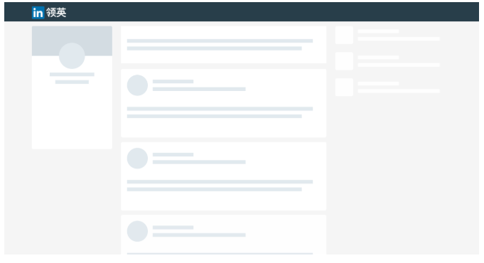

# SSR&CSR
> 分别是服务器端渲染和客户端渲染

<!-- TOC -->

- [SSR&CSR](#ssrcsr)
  - [SSR&CSR名词释义](#ssrcsr名词释义)
    - [问题存在](#问题存在)
  - [进阶](#进阶)
    - [CSR优化](#csr优化)
      - [骨架屏](#骨架屏)
  - [链接](#链接)

<!-- /TOC -->

## SSR&CSR名词释义

* SSR - 就是后端渲染
* CSR - 前端渲染

就如同之前学习`nodejs`服务器那样，希望请求一个地址，然后返回一个网页。

这个网页是后端生成（不讨论是以怎样的方式），浏览器得到保存在返回`body`内部的数据。

然后就把这个页面呈现到浏览器上。

这就是后端渲染。

而前端渲染，类似`github.io`的个人博客。就是写好一个`html`放在服务器上，页面数据不再是在返回`body`内部。

前端渲染关注UI的开发，数据请求则是通过`ajax`等方式。

### 问题存在

这里说说`SSR`优势，作为一个前端`CSR`的优势就不说了。

* 爬虫 - 可能是历史相关，`SSR`可以被爬虫很好的理解。而`CSR`不行。
* 首页白屏 - 对于`SSR`来说，一个地址对应一个页面，一个页面对应一个请求数据`body`。所以对单个页面来说，页面数据更少（虽然服务器压力大）。和`SPA`那种将所有数据打包在一起的情况，第一次加载页面的话，启动速度更快。

## 进阶

[这篇文章写的更精细，如果全部明白，理解也就差不多了](https://github.com/camsong/blog/issues/8)

### CSR优化

针对SSR优势优化CSR:

* 首页白屏 - 起源就是加载时候请求过多的后台资源，请求越多就加载时间越长。就像是页面没有的东西，然后突然出现了一堆数据。具体优化步骤可参考[此链接](https://zhuanlan.zhihu.com/p/29433875)。

不过`vue-router`出现其实也就是为了这个方面而发生的优化。

里面提到了一个几点值得注意，是之后项目优化的方向：

1. 优化视觉体验 - 骨架屏，就是在数据还有加载进来的时候，出现类似下图的效果：

**优化思路:** 写出数据未加载时候默认样式，图片，字体背景等。可是如何在加载完成之后去掉？

2. 主要是图片引起图片加载时间，可以使用`v-lazy`进行图片的懒加载。
3. 过渡效果，特别是路由的过渡效果。给了后台请求数据的时间。

* SEO - 爬虫，这一点好像[不需要前端来考虑](https://www.zhihu.com/question/68677077)，几个搜索公司都做的不错。

#### 骨架屏

骨架屏幕是我没有接触的一点，我需要进一步找资料学习实践，再另外写一篇文章。至于另外两个实现起来都比较简单

1. 图片懒加载 - `v-lazy`
2. 过渡 - 路由过渡效果

## 链接

[Nuxt - Vue的服务端渲染](https://zh.nuxtjs.org/)